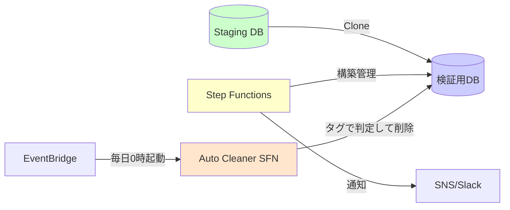
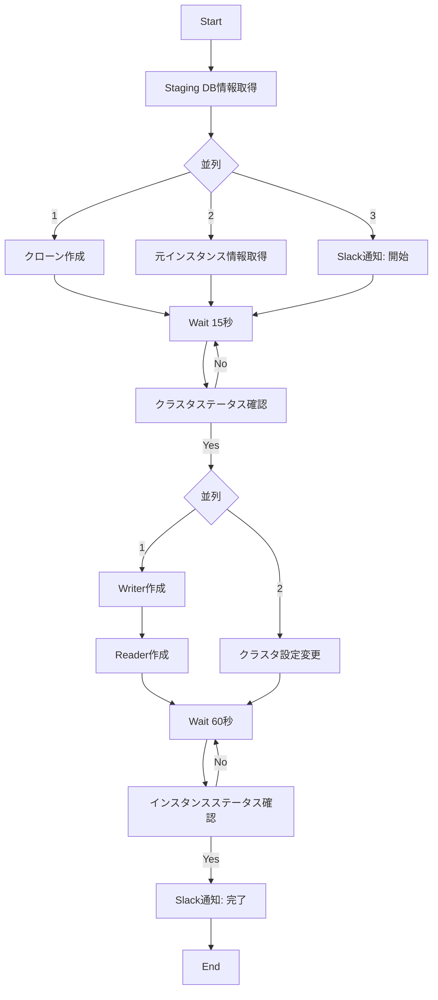
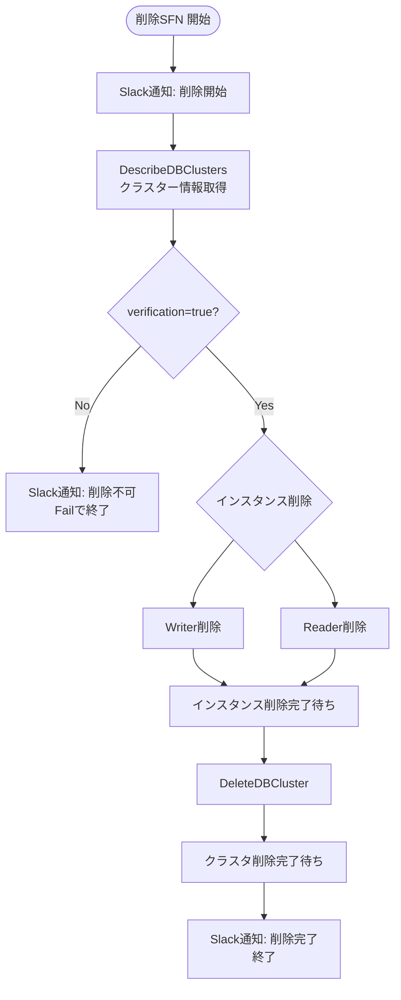

## はじめに

この記事が解決する問題は **ただひとつ**です。

> **「Staging を壊さず、本番相当データで安心して破壊的な検証をしたい」**

多くのチームがこの矛盾に悩んでいます。

- スナップショット復元は *毎回 1 時間コース*  
- Staging は共用なので *壊すと怒られる*  
- 検証用 DB を常時立てると *コストが重すぎる*  

その結果、誰も攻めた検証ができず、**本番にデプロイするまで重大な問題に気づけない**。

この記事では、こうした状況を **実際に運用して解決している構成** を紹介します。

---

## 結論：使い捨ての検証用 DB を「15 分で自動構築 & 毎日自動削除」する

構成は以下の通りです。



ポイントは 3 つ。

1. Aurora クローンで **数分〜10 分程度**でクローンを生成  
2. Step Functions が、構築〜設定〜通知までを完全自動化し、**トータル 15 分程度で検証DBを用意**  
3. EventBridge + 別の Step Functions が、**`auto_delete=true` のクローンを毎日削除**

これにより、**Staging を汚さず攻めた検証がいつでも実施可能**になります。

---

## 前提条件

以下が整っていることが前提です。

- Staging は本番から定期リフレッシュされている  
- 個人情報はマスク済み  
- ParameterGroup/OptionGroup やインスタンスクラスが本番に近い  

Staging 側が不安定なら、**先にそこを整備すべき**です。  
Staging の品質が低い状態でクローンだけ増やすと、  
「それっぽい検証はできているが、本番では再現しない」という不健康な状態になります。

---

## なぜ「検証用 DB」が必要なのか

### 1. Staging は壊せない

やりたい検証：

- スキーマ変更のリハーサル  
- 負荷試験  
- 特殊データ大量投入の再現試験  

これらはすべて **Staging を壊しうる**ので、共用環境ではやりづらい。  
結果として **本番で初めて破綻に気づく**。

### 2. スナップショット復元は遅すぎて使い物にならない

復元フローはこうです。

1. スナップショット選択  
2. パラメータ・サブネット・SG 設定  
3. 復元待ち（20〜30 分）  
4. インスタンス作成  
5. 接続・調整  

現実としては **50〜60 分かかる**。  
人力で毎回やるには重すぎる。

### 3. 常設検証 DB はコストが高すぎる

使うのは週に数回なのに、  
中規模インスタンスを 1 台常設すると **月 5 万円クラス**の固定費が発生する。

---

## 解決策の設計思想

目的は単純です。

> **「必要なときだけ、本番相当の DB を 15 分で作り、不要になったら自動で消す」**

この要件を満たす最小構成が  
**Aurora クローン × Step Functions** でした。

---

## Aurora クローンの強み

| 項目 | スナップショット復元 | Aurora クローン |
|------|-----------------------|------------------|
| 作成時間 | 20〜30 分 | **約 5〜10 分** |
| 課金 | フルサイズ | **差分のみ** |
| データ整合性 | 時点 | **完全一致** |
| 構築手順 | 複雑 | **シンプル** |

クローンは copy-on-write 方式なので、  
**短期検証ならほぼストレージコストが発生しない**のが特徴です。

この記事の構成では、クローン作成（5〜10 分）に加えて、  
インスタンス作成や設定反映・状態確認などを含めて **トータル 15 分程度** で検証用 DB を用意しています。

---

## Step Functions で “人間の手順” を完全自動化する

Lambda は使っていません。  
すべて AWS SDK 統合で記述しています。

- クローン作成  
- Writer / Reader 作成  
- 設定変更  
- ステータス待ち  
- Slack 通知  
- タグ付け（`verification=true`, `auto_delete=true`）

この一連を機械化することで、  
**構築時間は“ほぼ待ち時間”だけになり、15 分で完了する**状態にしています。

---

## ワークフロー全体像（生成側）



---

## クローン作成ステート例

```json
{
  "Type": "Task",
  "Resource": "arn:aws:states:::aws-sdk:rds:restoreDBClusterToPointInTime",
  "Parameters": {
    "SourceDBClusterIdentifier": "staging-db-cluster",
    "DbClusterIdentifier": "staging-verify-xxxxx",
    "RestoreType": "copy-on-write",
    "UseLatestRestorableTime": true,
    "Tags": [
      {"Key": "verification", "Value": "true"},
      {"Key": "auto_delete", "Value": "true"}
    ]
  }
}
```

- `copy-on-write` … クローン作成が速い  
- `UseLatestRestorableTime` … Staging の最新状態をそのまま使う  
- `verification=true` … 「検証用クローン」であることを明示  
- `auto_delete=true` … 自動削除対象としてマーク  

---

## 自動削除の仕組み

### 全体像

- EventBridge Scheduler が **毎日 0 時** に Auto Cleaner（ステートマシン A）を起動  
  - 実際のスケジュールはチーム事情に合わせて変更可能です  
- Auto Cleaner は `DescribeDBClusters` で全クラスタを取得  
- 各クラスタごとに
  - `auto_delete=true`
  - `verification=true`
  の 2 つのタグを見て、
  - 両方満たすものだけ、削除用ステートマシン B を同期実行

図にするとこうなります。


---

### 自動削除ステートマシン（Auto Cleaner）の構造

実装は Step Functions の `Map` + `INLINE ItemProcessor` で書いています。

やっていることを擬似的に表現すると、こうなります。

```pseudo
StateMachine AutoCleaner:
  clusters = DescribeDBClusters()

  for cluster in clusters:
    autoDelete   = tag(cluster, "auto_delete")   or "false"
    verification = tag(cluster, "verification")  or "false"

    if autoDelete == "true" and verification == "true":
      StartExecutionSync(DeleteClusterStateMachine, {
        "DbClusterIdentifier": cluster.DbClusterIdentifier
      })
    else:
      // 何もしない
```

ここで呼び出している `DeleteClusterStateMachine` が、  
実際の「検証用クラスター削除ステートマシン」です。

---

### 検証用クラスター削除ステートマシンの流れ

削除側のステートマシンは、ざっくり言うと **「タグチェック → インスタンス削除 → クラスタ削除 → 通知」** を行っています。



実際の ASL では、Describe + Wait のポーリングやエラーハンドリング、  
削除中 / NotFound の扱いなども細かく定義していますが、  
構造としては上記の通りです。

---

### なぜ「経過時間チェック」は入れていないのか

現時点では、次の判断です。

- 削除タイミングは「毎日 0 時」で十分  
- 「作った直後に消される」と困る運用は今はしていない  
- 条件を増やしすぎると、タグ付けミス時に「いつまでも消えない」リスクも増える  

もし「作成から 24 時間は必ず残したい」といった要件が出てきたら、  
`ClusterCreateTime` を使って JSONata で差分時間を計算するだけで拡張できます。

---

## 導入効果

### コスト削減

| 項目 | 従来 | 新方式 |
|------|------|--------|
| 稼働時間 | 720h | 80h |
| 月額コスト | 約 5 万円 | 約 5 千円 |
| 削減率 | - | **約 90% 減** |

インスタンスクラスや利用頻度によって変動はありますが、  
**「常設 1 台」から「必要時のみ」に切り替えると、このレベルの削減は十分狙えます。**

### 運用負荷削減

| 項目 | 手動 | 自動化後 |
|------|------|-----------|
| DB 構築 | 50〜60 分 | **15 分（待つだけ）** |
| 削除作業 | 10 分 | **0 分** |
| ヒューマンエラー | 手順ミスがあり得る | ステートマシンが機械的に実行 |

---

## 運用して分かった落とし穴

実際に回して分かった注意点を挙げておきます。

- クローンを長期間放置すると差分課金が肥大する（なので自動削除はほぼ必須）  
- 元クラスタが重いとクローン作成が遅延する
- Describe API が遅いので、ポーリング間隔を攻めすぎると API 制限に刺さる  
- Auto Cleaner は `DescribeDBClusters` で全クラスタを見る構成なので、  
  **`auto_delete` / `verification` タグの付け方を誤ると、本来消すべきでないクラスタも削除され得る**  
  - 実運用では、クローン用クラスター名にプレフィックスを付けるなど、  
    「削除対象とそれ以外を名前とタグの両方で分けておく」ほうが安全  

---

## まとめ

この構成により、

- **破壊的な検証がいつでもできる**  
- **Staging を壊す不安がなくなる**  
- **環境構築が 15 分で終わる**  
- **削除作業が完全自動化される**  
- **固定費が大幅に削減される**

一方で、Aurora クローンは差分課金や元クラスタ負荷といったリスクも持っています。  
そこを理解した上で、この仕組みを「本番に近い検証を攻めて実行するための装置」として使うのが妥当な落としどころです。

「本番相当データで検証したいが、Staging を壊すのが怖い」  
そう悩んでいるチームに対して、  
**実際に運用している現実解として、そのまま持っていける構成** になっています。
