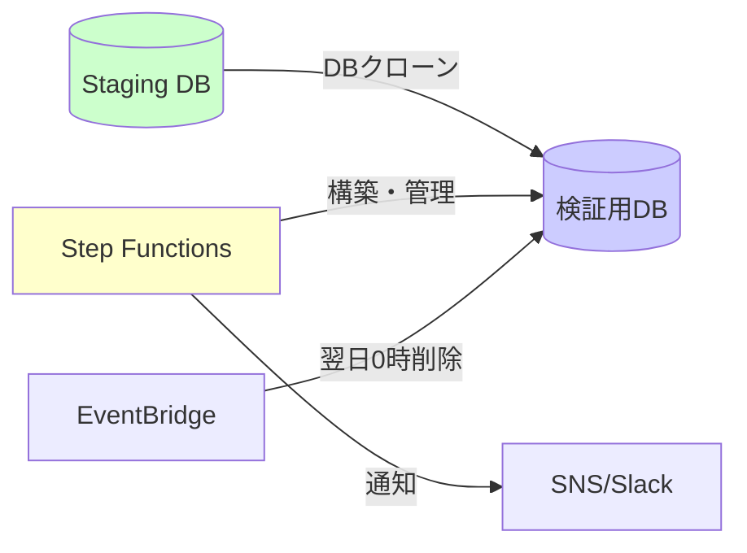
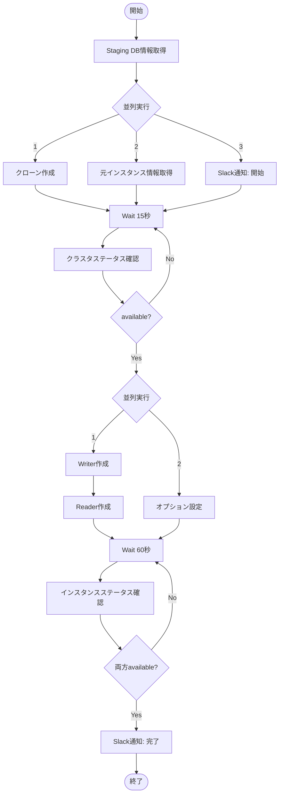

# Step FunctionsでAurora DBクローンを自動化  
Staging環境から**一時的な検証用DB**を自動構築する仕組みを紹介します。



## はじめに

多くのサービスでは、本番に近い Staging 環境を用意し、その上で動作確認やリグレッションテストを行っていると思います。  
一方で、次のような悩みを感じる場面も多いのではないでしょうか。

- Staging は共用環境のため、破壊的な検証がしづらい
- スナップショット復元による検証用 DB の作成は手作業が多く、時間もかかる
- 常時起動の検証用 DB を用意するほどのコストはかけづらい

筆者のチームでも同様の状況があり、「本番相当のデータで検証したいが、Staging を壊すわけにはいかない」というジレンマが長く続いていました。

そこで、本記事では **Staging DB をソースに Aurora DB クローンを作成し、Step Functions で自動化する構成** を紹介します。  
これにより、必要なときに数分で検証用 DB を用意し、検証終了後は自動削除する運用が可能になります。

## 背景：Staging 環境におけるよくある課題

まず、Staging 環境でありがちな課題を整理します。

### 共用 Staging を壊せない

Staging 環境は複数チーム・複数開発者で共用されていることが多く、次のような検証は実施しづらいです。

- 大規模なスキーマ変更のリハーサル
- データを大きく書き換える負荷試験
- 特定のデータセットを作り込んだバグ再現

「Staging を元の状態に戻す」こと自体が手間であり、他メンバーの作業にも影響するため、どうしても慎重にならざるを得ません。

### 手動復元のコスト

Staging のスナップショットから別クラスターを復元し、検証用 DB を用意することも可能です。しかし、コンソールから手動で実施すると次のようなフローになります。

1. 対象スナップショットの選択  
2. 復元パラメータ（クラスター名・サブネット・セキュリティグループ等）の設定  
3. 復元完了まで待機  
4. インスタンス作成・各種パラメータ設定  
5. 接続確認・動作確認  

この作業には 50〜60 分ほどかかることもあり、ヒューマンエラーの余地もあります。  
検証のたびにこの手順を踏むのは現実的ではありません。

### 検証用 DB の常時稼働はコストが高い

常に検証用 DB を 1 台用意しておく、という解決策もありますが、次のような課題があります。

- Staging と同等スペックの場合、月額コストがそれなりに高い
- データを定期的に最新化しないと、検証結果の信頼性が下がる
- 「誰がいつ使っているか」が不明瞭になり、削除タイミングの判断が難しい

このように、Staging だけではカバーしきれない検証ニーズが存在します。

## Aurora DB クローンの特徴

ここで、Aurora の DB クローン機能について簡単に整理します。

### スナップショット復元との比較

| 項目             | スナップショット復元      | DB クローン                     |
|------------------|--------------------------|---------------------------------|
| 作成時間         | 20〜30 分程度           | 5〜10 分程度                    |
| 初期ストレージ   | フルサイズ分課金         | 差分のみ課金 (copy-on-write)   |
| データ整合性     | 指定時点のスナップショット | 元クラスタと完全一致           |
| 作成手順         | 復元 + 各種設定が必要     | 比較的シンプル                  |
| 更新の影響       | 元クラスタとは独立       | 差分が増えるとストレージ増加   |

Aurora クローンは copy-on-write 方式のため、**短期間の検証であればストレージコストを抑えつつ高速にクローンを作成できる**のが特徴です。

### Staging DB をソースにする利点

本記事では、本番 DB ではなく Staging DB をクローンのソースとしています。これには次のような利点があります。

- Staging 作成時点で個人情報がマスクされている  
- 本番クラスタの権限をクローン用ワークフローに付与する必要がない  
- 本番相当のデータ量・データパターンを使いつつ、コンプライアンス上のリスクを抑えられる  

「Staging のデータ品質を活かしつつ、検証は別クラスターで行う」というスタイルを取りやすくなります。

## 解決策の概要：Step Functions による自動化

上記の課題と Aurora クローンの特徴を踏まえ、次のような構成を採用しました。

- Aurora クローン作成を Step Functions の AWS SDK 統合で自動化する
- クラスター作成・インスタンス作成・各種設定・Slack 通知までを 1 つのステートマシンにまとめる
- タグと EventBridge Scheduler を組み合わせて、検証用 DB を翌日自動削除する

### なぜ Step Functions を利用するか

Aurora 関連の API 呼び出しは、Lambda から実装することもできますが、今回は Step Functions の **AWS SDK 統合**を利用しました。

- RDS の API 呼び出しを JSON で定義できる  
- Lambda 関数のデプロイ・管理が不要  
- エラー時のリトライや分岐をステートマシン側で定義できる  

特に「インフラ寄りのオーケストレーション」を行う場合、Step Functions の方が構成が素直になりやすいと感じています。

### やっていることの全体像

ワークフローとしては、次のような処理を実施します。

- Staging DB クラスタの情報取得  
- Aurora クローンの作成開始  
- Writer / Reader インスタンスの作成  
- クラスター・インスタンスの状態が `available` になるまでポーリング  
- 検証用クラスター向けの設定調整（バックアップ無効化など）  
- 開始／完了の Slack 通知  
- タグ付け（`auto_delete=true`）による自動削除対象の明示  

これらをすべて Step Functions のステートマシンとして定義しています。

## ワークフローの詳細

全体のフローを Mermaid で表すと次のようになります。



図だけだと少し複雑に見えますが、実際には「作成 → 状態確認 → 次の処理」という単純な流れの繰り返しです。

## 実装ポイント

ここからは、いくつかのステートについてポイントを絞って紹介します。

### クローン作成ステート

```json
{
  "Type": "Task",
  "Resource": "arn:aws:states:::aws-sdk:rds:restoreDBClusterToPointInTime",
  "Parameters": {
    "SourceDBClusterIdentifier": "staging-db-cluster",
    "DbClusterIdentifier": "staging-verify-xxxxx",
    "RestoreType": "copy-on-write",
    "UseLatestRestorableTime": true,
    "Tags": [
      {"Key": "verification", "Value": "true"},
      {"Key": "auto_delete", "Value": "true"}
    ]
  }
}
```

- `RestoreType` に `copy-on-write` を指定することでクローンになります。  
- `Tags` に `auto_delete=true` を付与しておくと、後述する自動削除の対象として扱いやすくなります。

### 並列実行による短縮

```json
{
  "Type": "Parallel",
  "Branches": [
    { "StartAt": "RestoreDBCluster" },
    { "StartAt": "DescribeDBInstances" },
    { "StartAt": "SendSlackNotification" }
  ]
}
```

クローン作成の開始、元インスタンス情報の取得、開始通知を並列実行しています。  
1 つ 1 つ直列に実行することも可能ですが、並列にすることでリードタイムを少しでも短縮しています。

### 状態確認のポーリング

```json
{
  "Type": "Choice",
  "Choices": [{
    "Variable": "$.Status",
    "StringEquals": "available",
    "Next": "CreateInstances"
  }],
  "Default": "Wait15Seconds"
}
```

RDS のクラスタやインスタンスは状態遷移に一定時間を要するため、Describe API を用いたポーリングが必要です。  
ここでは 15 秒間隔でクラスタのステータスを確認し、`available` になったタイミングで次のステップに進めています。

## 自動削除の仕組み

検証用 DB は「使い捨て」が前提のため、作りっぱなしにしない仕組みが重要です。  
本構成では、EventBridge Scheduler とタグを用いて翌日 0 時に自動削除するようにしています。

### EventBridge Scheduler の例

以下はイメージとなる JSON 例です。

```json
{
  "ScheduleExpression": "cron(0 0 * * ? *)",
  "Target": {
    "Arn": "arn:aws:states:::aws-sdk:rds:deleteDBCluster",
    "Input": {
      "DBClusterIdentifier": "staging-verify-xxxxx",
      "SkipFinalSnapshot": true
    }
  }
}
```

実際には、`auto_delete=true` タグが付与されたクラスターを列挙し、作成から一定時間以上経過しているものを削除対象とするような実装にしています。

## 導入効果

### コスト面の効果

Aurora は DB クラスごとに秒課金されます。  
例えば ap-northeast-1 の中規模インスタンスを 1 台常時稼働させると、それなりの月額コストになります。

今回の仕組みでは、検証時のみ検証用 DB(db.t4g.large) を起動する運用としたことで、次のようなイメージの削減効果が得られました。

| 項目       | 従来（常時稼働） | 新方式（必要時のみ） |
|------------|------------------|----------------------|
| 稼働時間   | 24 時間/日       | 8 時間/日（例）      |
| 月間稼働時間 | 720 時間        | 240 時間             |
| 月額コスト | 約 5 万円       | 約 2 万円          |
| 削減率     | -                | 約 67% 削減          |

あくまで一例ですが、「常時 1 台起動しておく構成」と比較すると、かなり素直にコストが下がる印象です。

### 運用面の効果

作業時間と運用負荷についても、次のような改善がありました。

| 項目       | 手動作業          | 自動化後                 |
|------------|-------------------|--------------------------|
| 環境構築   | 50〜60 分         | 10 分程度（ほぼ待ち時間） |
| 削除作業   | 10 分             | 0 分（自動削除）          |
| ミス       | 手順ミスが発生しうる | ステートマシン定義通りに実行 |

特に「Staging を壊してしまうかもしれない」という心理的な負荷が減り、  
破壊的な検証や負荷試験を実施しやすくなった点は大きなメリットでした。

## 注意点・ハマりどころ

実際に運用してみて、いくつか注意が必要だと感じた点も挙げておきます。

- クローンは差分課金のため、大量の更新が行われるとストレージコストが増加する  
- クローン元の Staging クラスタがメンテナンス中・`available` 以外の状態の場合、クローン作成が遅延・失敗する可能性がある  
- Step Functions の実行ロールに付与する権限は、対象クラスターを Staging のみに絞るなど、最小限にすることが望ましい  

このあたりを踏まえつつ、用途に適したクローン期間・クラスター数を調整する必要があります。

## Staging DB 側の前提条件

本記事の構成がうまく機能するためには、Staging DB 側にもいくつか前提があります。

- 本番 DB から定期的にリフレッシュされていること  
- Staging 作成時に個人情報がマスクされていること  
- 本番に近いパラメータグループ・インスタンスクラスを採用していること  

これらが満たされていない場合、まずは Staging 環境自体の整備を優先した方がよいケースもあります。

## まとめ

本記事では、Step Functions と Aurora DB クローンを組み合わせて、Staging 環境から検証用 DB を自動構築する仕組みを紹介しました。

- Aurora クローンを利用することで、5〜10 分程度で検証用 DB を作成可能  
- Step Functions の AWS SDK 統合により、Lambda なしで構成をシンプルに保てる  
- タグと EventBridge Scheduler を用いることで、検証用 DB の自動削除を実現  
- コスト削減と作業時間削減、そして心理的な負荷軽減につながる  

Aurora を利用していて「検証環境をどう用意するか」に課題を感じている方にとって、1 つの参考例になれば幸いです。
