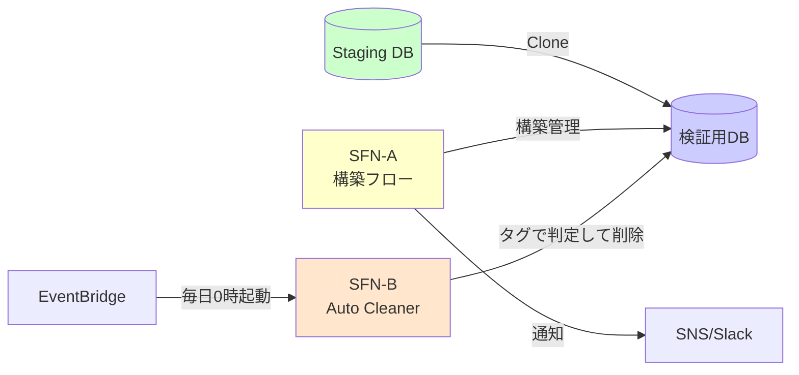
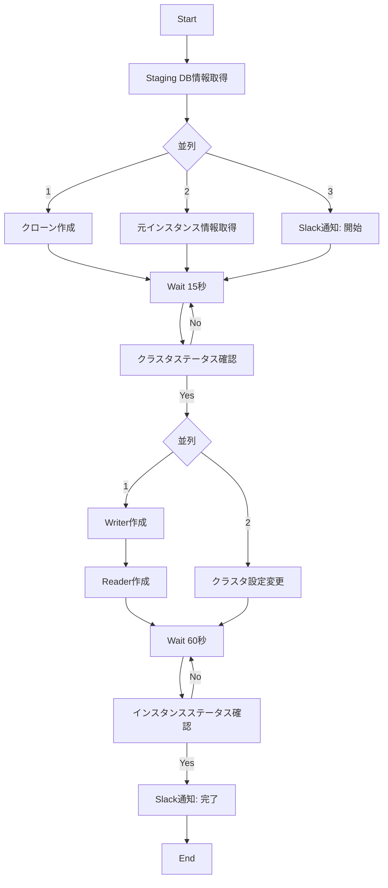
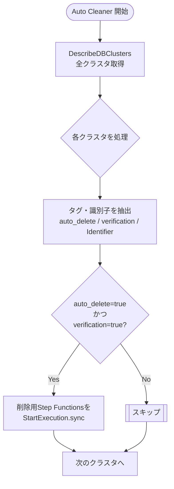
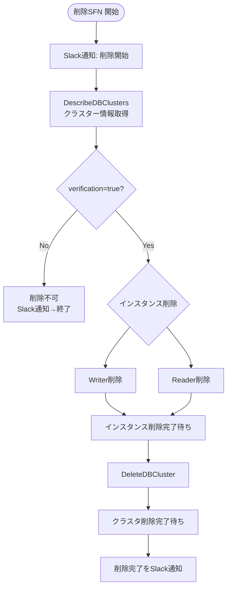

## はじめに

この記事が向き合っているのは、かなりシンプルだけど、多くのチーム（自分たちも含めて）がつまずきがちな問題です。

> **「Staging を壊さず、本番相当データで安心して破壊的な検証をしたい」**

現場でよくあるのは、次のような状況です。

- スナップショット復元は *毎回 1 時間コース*  
- Staging は共用なので *壊すと怒られる*  
- 検証用 DB を常時立てると *コストが重すぎる*  

その結果、攻めた検証は後回しになり、  
**本番にデプロイする直前まで重大な問題に気づけない**ことがあります。

この記事では、この状況を実際にどう解消したか、  
**いま運用している構成**をベースに紹介します。

---

## 結論：使い捨ての検証用 DB を「15 分で自動構築 & 毎日自動削除」する

最初にゴールだけ書いておきます。

- 必要になったら 15 分で検証用 DB を自動構築
- 翌日には自動で削除される
- 元の Staging は一切触らない

構成はざっくりこんな形です。



ポイントは 3 つです。

1. Aurora クローンで **数分〜10 分程度**でクローンを生成  
2. Step Functions が、構築〜設定〜通知までを自動化し、**トータル 15 分程度で検証 DB を用意**  
3. EventBridge + 別の Step Functions が、**`auto_delete=true` のクローンを毎日削除**

これで、**Staging を汚さずに攻めた検証がいつでもできる**ようになります。

---

## 前提条件

この構成が素直に効くためには、Staging 側に最低限の前提があります。

- Staging は本番から定期的にリフレッシュされている  
- 個人情報はマスク済み  
- ParameterGroup / OptionGroup やインスタンスクラスが本番に近い  

ここが怪しい場合は、**まず Staging を整える方が先**です。  
Staging の品質が低い状態でクローンだけ増やすと、  
「それっぽい検証はできるが、本番では再現しない」という微妙な状態になります。

---

## 本記事での「検証用 DB」の定義

本記事で言う「検証用 DB」は、次のようなものを指します。

> **Staging DB をソースに、短期間だけ使う前提で作る Aurora クローン（別クラスタ）。**

- Staging とは完全に独立したクラスターとして動く  
- 本番相当（マスク済）のデータを扱える  
- 用途が終われば削除してよい、**使い捨て前提の DB**  

この前提を置いておくと、以降の話がつながりやすくなります。

---

## なぜ「検証用 DB」が必要なのか

### 1. Staging は壊せない

やりたい検証としては、例えばこんなものがあります。

- スキーマ変更のリハーサル  
- 負荷試験  
- 特殊データ大量投入の再現試験  

どれも **Staging を壊しうる**ので、共用環境ではやりづらい。  
結果として、**本番になって初めて破綻に気づく**というパターンが生まれます。

### 2. スナップショット復元は遅すぎて現実的ではない

スナップショット復元の流れはだいたいこんな感じです。

1. スナップショット選択  
2. パラメータ・サブネット・SG 設定  
3. 復元待ち（20〜30 分）  
4. インスタンス作成  
5. 接続・調整  

現実的には **50〜60 分はかかる**ので、  
「ちょっと試したい」レベルの検証ではまず使われません。

### 3. 常設検証 DB はコストが合わない

使うのは週に数回なのに、  
中規模インスタンスを 1 台常設すると **月 5 万円クラス**の固定費になります。

「いつ使うかわからないが、ないと不安だから」とりあえず立てておく──  
このパターンは、だいたい後から後悔します。

---

## 解決策の設計思想

やりたいことはシンプルです。

> **「必要なときだけ、本番相当の DB を 15 分で作り、不要になったら自動で消す」**

この条件を満たすために選んだのが、  
**Aurora クローン × Step Functions** という組み合わせです。

---

## Aurora クローンの強み

| 項目 | スナップショット復元 | Aurora クローン |
|------|-----------------------|------------------|
| 作成時間 | 20〜30 分 | **約 5〜10 分** |
| 課金 | フルサイズ | **差分のみ** |
| データ整合性 | 時点 | **完全一致** |
| 構築手順 | 複雑 | **シンプル** |

クローンは copy-on-write 方式なので、  
**短期検証ならストレージコストがほとんど増えません。**

内部的には元クラスタのストレージページを参照するため多少のオーバーヘッドはありますが、  
実運用では問題になるほどの負荷はかからず、**よほどクローンを大量に立てない限り気にする必要はありません。**

この記事の構成では、クローン作成（5〜10 分）に加えて、  
インスタンス作成や設定反映・状態確認まで含めて、  
**トータル 15 分程度で検証用 DB を用意**しています。

---

## Step Functions で “人間の手順” を全部落とす

Lambda は使っていません。  
すべて Step Functions の AWS SDK 統合で書いています。

- クローン作成  
- Writer / Reader 作成  
- クラスタ設定変更  
- ステータス待ち  
- Slack 通知  
- タグ付け（`verification=true`, `auto_delete=true`）

人間がコンソールでやっていた手順を、そのまま機械に落とし込んだイメージです。  
これで、**構築はほぼ「待ち時間」だけになり、15 分で終わります。**

---

## 開発体験が変わる — 本番相当データを“手元で扱える”

この仕組みでもう一つ大きいのは、**開発の検証サイクルが軽くなること**です。

以前の検証ループは、だいたいこんな感じでした。

```
コード修正
→ デプロイ
→ Staging でバッチ実行
→ 結果確認
→ さらに修正
→ 再デプロイ…
```

見ての通り、**遅いし重いです**。

検証用 DB がすぐ作れるようになってからは、こう変わります。

```
手元のコードを修正
→ 検証用 DB に直接接続して実行
→ すぐ結果を確認
→ 気になればその場で再実行
```

つまり、

> **「ローカル環境のコードで、本番相当データを相手にガンガン試せる」**

という状態になります。

これは QA 工程がラクになるだけでなく、  
**開発のスピードそのものが上がる**ので、体感としてもかなり効きます。

---

## ワークフロー全体像（生成側）



---

### クローン作成ステートの例

```json
{
  "Type": "Task",
  "Resource": "arn:aws:states:::aws-sdk:rds:restoreDBClusterToPointInTime",
  "Parameters": {
    "SourceDBClusterIdentifier": "staging-db-cluster",
    "DbClusterIdentifier": "staging-verify-xxxxx",
    "RestoreType": "copy-on-write",
    "UseLatestRestorableTime": true,
    "Tags": [
      {"Key": "verification", "Value": "true"},
      {"Key": "auto_delete", "Value": "true"}
    ]
  }
}
```

- `copy-on-write` … クローン作成が速い  
- `UseLatestRestorableTime` … Staging の最新状態をそのまま使う  
- `verification=true` … 「検証用クローン」であることを明示  
- `auto_delete=true` … 自動削除の対象としてマーク  

---

## 自動削除の仕組み

### 全体の流れ

- EventBridge Scheduler が **毎日 0 時** に Auto Cleaner（ステートマシン A）を起動  
- Auto Cleaner は `DescribeDBClusters` で全クラスタを取得  
- 各クラスタごとに  
  - `auto_delete=true`  
  - `verification=true`  
  の 2 つのタグを見て、両方満たすものだけ削除用ステートマシン B を同期実行

図にするとこうなります。



---

### Auto Cleaner の中身

実装は Step Functions の `Map` + `INLINE ItemProcessor` で書いています。

やっていることをざっくり書くと、こうです。

```pseudo
StateMachine AutoCleaner:
  clusters = DescribeDBClusters()

  for cluster in clusters:
    autoDelete   = tag(cluster, "auto_delete")   or "false"
    verification = tag(cluster, "verification")  or "false"

    if autoDelete == "true" and verification == "true":
      StartExecutionSync(DeleteClusterStateMachine, {
        "DbClusterIdentifier": cluster.DbClusterIdentifier
      })
    else:
      // 何もしない
```

ここで呼び出している `DeleteClusterStateMachine` が、  
実際にクラスターとインスタンスを消していく側のステートマシンです。

---

### 検証用クラスター削除ステートマシンの流れ

削除側のステートマシンは、ざっくり言うと  
**「タグチェック → インスタンス削除 → クラスタ削除 → 通知」** という流れになっています。



実際の ASL では、Describe + Wait のポーリングやエラーハンドリング、  
削除中 / NotFound の扱いなどをもう少し細かく書いていますが、  
構造としては上の通りです。

---

### なぜ「経過時間チェック」は入れていないのか

ここはよく聞かれそうなので、理由を書いておきます。

- 一般的には「作成から◯時間経過したら削除」といった条件を入れる構成もあり得る  
- 今回の運用では、**「毎日0時に一括削除」だけで十分**だった  
- 条件を増やしすぎると、タグ付けミスなどで「いつまでも消えないクローン」が増えるリスクもある  

「作成から 24 時間は必ず残したい」といった要件が出てくれば、  
`ClusterCreateTime` を使って JSONata で時間差を計算するだけなので、  
後から足すのも難しくありません。

---

## 導入効果

### コスト面

| 項目 | 従来 | 新方式 |
|------|------|--------|
| 稼働時間 | 720h | 80h |
| 月額コスト | 約 5 万円 | 約 5 千円 |
| 削減率 | - | **約 90% 減** |

インスタンスクラスや利用頻度によって上下はしますが、  
**「常設 1 台」から「必要なときだけ起動」に切り替えると、このくらいのオーダー感で落ちます。**

### 運用面

| 項目 | 手動 | 自動化後 |
|------|------|-----------|
| DB 構築 | 50〜60 分 | **15 分（待つだけ）** |
| 削除作業 | 10 分 | **0 分** |
| ヒューマンエラー | 手順ミスがあり得る | 定義どおりに自動実行 |

---

## 運用してみてわかった落とし穴

実際に回してみて「ここは気をつけたほうがいい」と感じたところも挙げておきます。

- クローンを長期間放置すると、差分課金がじわじわ効いてくる（自動削除はほぼ必須）  
- 元クラスタが重いと、クローン作成が遅延する  
- Describe 系 API はそこまで安くないので、ポーリング間隔を攻めすぎると制限に当たる  
- Auto Cleaner は `DescribeDBClusters` で全クラスタを見るので、  
  **`auto_delete` / `verification` のタグを誤って本番側につけると普通に危ない**  
  - クローン用クラスター名にプレフィックスを付けるなど、  
    「名前」と「タグ」の両方で削除対象を絞るようにしている  

---

## まとめ

この構成を入れた結果としては、ざっくりこうなりました。

- **破壊的な検証がいつでもできるようになった**  
- **Staging を壊す不安がなくなった**  
- **検証用 DB の構築が 15 分で終わるようになった**  
- **削除作業が完全に自動化された**  
- **ローカルから本番相当データを扱う高速な検証ループが回せるようになった**  
- **固定費もかなり削れた**

Aurora クローンには、差分課金や元クラスタ負荷といった注意点もあります。  
そこを踏まえたうえで、「本番に近い検証を攻めて実行するための装置」として使うのがちょうどいい落としどころだと感じています。

「本番相当データで検証したいけど、Staging を壊すのは怖い」  
というチームに対して、**現場で実際に回している解決策の一例として**参考になれば十分です。
