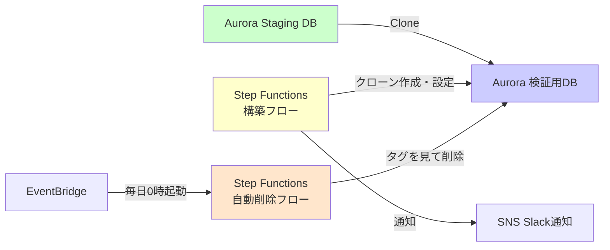
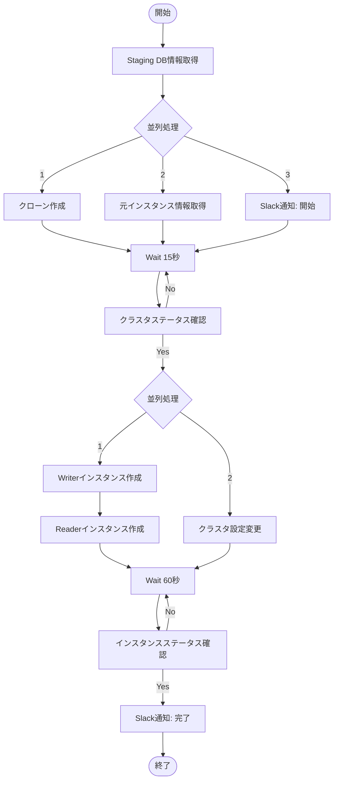
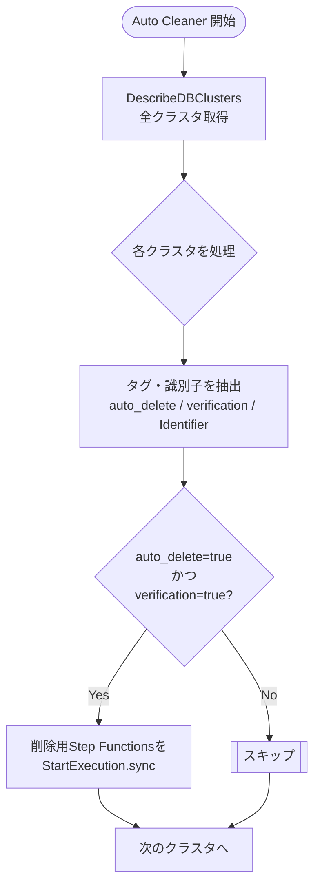
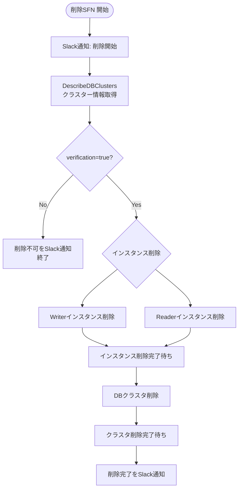

## はじめに

> 「Staging を壊さず、本番相当データで、個人ごとに攻めた検証をしたい」

実際の開発現場では、だいたいこんな状態になりがちです。

- スナップショット復元は **張り付き 30分〜1時間コース**  
- Staging は共用なので **壊すと支障が出る**  
- 検証用 DB を常時立てると **コストが重すぎる**  

「自分の検証用にデータを作り込みたい」「負荷をかけたい」と思っても、

- Staging は他の開発者も使う
- QA やリグレッションの最終確認にも使う

という事情があって、結局こうした「攻めた検証」は後回しになりがちです。  
その結果として、

- 負荷系・データ量起因の問題に **本番直前でようやく気づく**
- 修正しても **また Staging での再検証に時間がかかる**

といったパターンが起きます。いわゆる「十分な検証を左側（開発寄り）に寄せられていない」状態です。

この記事では、この状況をどう崩したか、いま実際に運用している構成と設計意図を書いていきます。

---

## 結論：使い捨ての検証用 DB を「15 分で自動構築 & 毎日自動削除」する

先にゴールを書いておきます。

- 必要になったら **15 分で検証用 DB を自動構築できる**
- 検証が終わったクローンは **翌日自動で削除される**
- 検証用 DB にどれだけ書き込んでも、**Staging のデータは壊れない**

構成はざっくりこんな形です。


```mermaid
graph LR
  A[Aurora Staging DB] -->|Clone| B[Aurora 検証用DB]
  C[Step Functions<br/>構築フロー] -->|クローン作成・設定| B
  D[EventBridge] -->|毎日0時起動| F[Step Functions<br/>自動削除フロー]
  F -->|タグを見て削除| B
  C -->|通知| E[SNS Slack通知]

  style A fill:#ccffcc
  style B fill:#ccccff
  style C fill:#ffffcc
  style F fill:#ffe6cc
```

やっていることは 3 つ。

1. Aurora クローンで、数分〜10 分程度でクローンを作る  
2. Step Functions(構築フロー)で、クローン作成〜設定変更〜Slack 通知までを自動化し、トータル 15 分程度で「使える状態」の検証 DB を用意する  
3. EventBridge + Step Functions（自動削除フロー）で、タグ付きのクローンだけを毎日削除し、使い捨て運用を回す  

対応関係としては、

- 1 + 2 → 「作るのに時間がかかりすぎる問題」と「作業がつらい問題」を潰す
- 3 → 「放置クローンでコストがじわじわ増える問題」を潰す

という役割分担。

---

## 前提条件と、その理由

この構成を効かすためには、Staging 側にいくつか前提があります。  

- **Staging は本番から定期的にリフレッシュされていること**  
  → 検証用 DB は Staging をソースにクローンします。Staging のデータが古いと、負荷試験や不具合再現の結果が本番とズレます。  
  → 「本番に近いデータで試せる」ことが、この構成の価値の半分なので、ここは前提にしています。

- **個人情報は Staging の時点でマスク済みであること**  
  → クローンは Staging のデータをそのままコピーオンライトします。  
  → つまり、**Staging に残っているものは検証用 DB にも載る**ので、開発者のローカルから触ってよい前提のデータになっている必要があります。

- **ParameterGroup / OptionGroup やインスタンスクラスが本番に近いこと**  
  → スロークエリやリソースボトルネックを見たいのに、本番と全然違う PG/OG・インスタンスクラスだと意味が薄れます。  
  → 特に性能検証をやるなら、ここは揃えておいた方がいいです。

- **データベースが Amazon Aurora であること**  
  → 今回使っている「高速なクローン機能」は Aurora 固有の仕組みです。  
  → RDS for MySQL/PostgreSQL のような通常の RDS では同じ構成は組めません。

このあたりが怪しい場合は、クローンの仕組みを入れる前に Staging を整える方が先になります。

---

## 本記事での「検証用 DB」の定義

ここで言う「検証用 DB」は、次のようなものを指します。

> Staging の Aurora クラスタをソースに、短期間だけ使う前提で作られた Aurora クローン（別クラスタ）。

- Staging とは別クラスタとして動作する  
- データは Staging 相当（マスク済み）  
- 使い終わったら削除前提の、使い捨て DB  

以降はこの意味で「検証用 DB」と書きます。

---

## なぜ「検証用 DB」が必要なのか

### 1. Staging でやりたいことと、守りたいことが衝突する

本来やりたいのは、例えば以下のような「攻めた検証」です。

- スキーマ変更のリハーサル（移行バッチの本番前テスト）
- 大量データを投入しての負荷試験・インデックス検証
- 特定ユーザーの履歴を作り込んでのバグ再現
- バッチ処理の全件再計算を模した検証

これらはどれも、**Staging のデータや性能に大きく影響を与えます**。

一方で Staging は、

- QA がリグレッションを回す
- プロダクトオーナーが画面を見て仕様確認をする

といった用途にも使われていて、「壊してしまうと普通に困る」環境でもあります。

結果として、こういうことが起こります。

- 「本当はもっと攻めた検証をしたいけど、Staging だと怖いのでやめておく」
- 「SRE / 他チームの承認がないと Staging を壊す系の検証ができない」

これが「攻めた検証」が後回しになる理由です。

### 2. スナップショット復元は、手作業だと現実的でない

「じゃあ、Staging のスナップショットから別クラスタを立てればいいのでは？」と思いますが、  
手作業でやると現実はこうなります。

1. スナップショットを選ぶ  
2. パラメータ・サブネット・SG を設定して復元開始  
3. クラスタ復元完了まで待つ（10〜20 分）  
4. インスタンスを作成し（10〜20 分）、エンドポイントやパラメータを調整  
5. 接続テストをして、アプリやツールから参照先を切り替える  

自分たちの環境（Aurora MySQL / 2TB 前後）で試したところ、  
この一連の作業に **30〜60 分はかかっていました**。  
人間が毎回やるには、かなり負荷が高いです。

### 3. 常設検証 DB は「保険のつもりが固定費になる」

もう一つのありがちな解決策が、「検証専用クラスタを 1 台立てっぱなしにする」です。

使うのは週に数回なのに、そこそこサイズのインスタンスを 24h 起動しておくと、月 5 万円クラスの固定費になります。使っていない時間に無駄なメーターが回り続ける状態。

---

## 解決策：Aurora クローン + Step Functions による自動化

やりたいことは単純で、

> 「必要なときだけ、本番相当の DB を 15 分で作り、終わったら自動で消す。」

この要件を満たすための組み合わせが、Aurora のクローン機能と Step Functions のオーケストレーションでした。

### Aurora クローンの特徴

| 項目 | スナップショット復元 | Aurora クローン |
|------|-----------------------|------------------|
| 作成時間 | 30〜60 分 | **約 10〜15 分** |
|課金 | フルサイズ | **差分のみ** |
| データ整合性 | 任意時点 | **最新の復旧可能時点（数分ラグの可能性）** |
| 構築手順 | 復元 + 調整 | **Step Functions 呼び出し** |

Aurora クローンは copy-on-write 方式なので、

- 作成直後は **元クラスタのストレージを参照していて差分のみ課金**
- 書き込みが増えるほどクローン側のストレージが増える（元/クローン双方への書き込みで差分ストレージが増える）

という仕組みになっています。

実際の運用では、**短期の検証であればストレージコストはほとんど問題になっていません**。  
I/O コストはクローン側でも通常どおり発生するので、スパイクさせる検証では I/O 課金も合わせて見るとよいです。

なお、`UseLatestRestorableTime` で作るクローンは「直近で復元可能な時点」を使うため、元クラスタの最新状態から数分のラグが生じることがあります。ほぼ最新だが厳密な同時点ではない点に注意してください。

極端にクローンを乱立させない限り、元クラスタ側の負荷も特に問題になりませんでした。

---

## Step Functions を選んだ理由

「Fargate や Lambda から AWS SDK を叩いても同じことできるのでは？」と思うかもしれません。

Step Functions（+ AWS SDK 統合）を選んだ理由はこんな感じです。

- **RDS API 呼び出しをコードではなく JSON で記述できる**  
  → インフラ寄りの処理なので、「誰が見ても分かる状態」で定義しておきたかった。

- **ポーリング・リトライ・分岐・並列実行を素直に表現できる**  
  → RDS の状態待ち（`available` になるまでなど）はどうしても必要になるので、  
    それをコードで書かずに、ステートマシン側で表現できるのは容易です。

- **Lambda を増やさなくてよい**  
  → デプロイフローや実行ロールの管理対象を増やしたくなかった、という実務的な理由もあります。

結果として、「人間がコンソールで手順を踏んでいた作業」をそのままフロー図にしたような形で実装できています。

---

## 開発体験の変化 — 本番相当データを“手元で回せる”

この構成を入れて一番効いたのは、実はインフラ側ではなく開発者の作業フローでした。

導入前は、負荷系・バッチ系の検証をやろうとすると、だいたいこんな流れでした。

```
コード修正
→ デプロイ
→ Staging でバッチ実行
→ 結果確認
→ さらに修正
→ 再デプロイ…
```

このループは、かなり遅い。

検証用 DB が 15 分で立つようになってからは、こう変わります。

```
検証用 DB を作成（待ち時間 15 分）
→ 手元のコードから検証用 DB に直に接続
→ 実行・結果確認
→ 即修正・再実行
```

つまり、「ローカルのコードから、本番相当データを相手にした検証ループを回せる」という状態になります。テスト工程というより、開発速度に直結する話です。

---

## 検証用 DB 構築フローの全体像

まずは「作る側」のフローです。


```mermaid
graph TD
  Start([開始]) --> Describe[Staging DB情報取得]

  Describe --> P1{並列処理}

  P1 -->|1| Clone[クローン作成]
  P1 -->|2| GetInstance[元インスタンス情報取得]
  P1 -->|3| NotifyStart[Slack通知: 開始]

  Clone --> Wait1[Wait 15秒]
  GetInstance --> Wait1
  NotifyStart --> Wait1

  Wait1 --> CheckCluster[クラスタステータス確認]
  CheckCluster -->|No| Wait1
  CheckCluster -->|Yes| P2{並列処理}

  P2 -->|1| CreateWriter[Writerインスタンス作成]
  P2 -->|2| ModifyCluster[クラスタ設定変更]

  CreateWriter --> CreateReader[Readerインスタンス作成]
  CreateReader --> Wait2[Wait 60秒]
  ModifyCluster --> Wait2

  Wait2 --> CheckInstances[インスタンスステータス確認]
  CheckInstances -->|No| Wait2
  CheckInstances -->|Yes| NotifyComplete[Slack通知: 完了]
  NotifyComplete --> End([終了])
```

実際にやっていることをざっくり書くと、

- Staging クラスタの情報取得  
- クローン作成（copy-on-write 指定、タグ付与）  
- Writer / Reader インスタンス作成  
- 検証用クラスタ向けの設定調整（バックアップ保持は最小の 1 日に下げる など）  
- クラスタ・インスタンスが `available` になるまでポーリング  
- 開始・完了を Slack に通知  

といった流れです。

### クローン作成ステートの例

実際の ASL の一部はこんなイメージです。

```json
{
  "Type": "Task",
  "Resource": "arn:aws:states:::aws-sdk:rds:restoreDBClusterToPointInTime",
  "Parameters": {
    "SourceDBClusterIdentifier": "staging-db-cluster",
    "DbClusterIdentifier": "staging-verify-xxxxx",
    "RestoreType": "copy-on-write",
    "UseLatestRestorableTime": true,
    "Tags": [
      {"Key": "verification", "Value": "true"},
      {"Key": "auto_delete", "Value": "true"}
    ]
  }
}
```

ポイントはこのあたりです。

- `copy-on-write` … クローン作成が速く、差分課金になる  
- `UseLatestRestorableTime` … Staging の最新状態をそのまま使う  
- `verification=true` … 「検証用クローン」であることを明示  
- `auto_delete=true` … 自動削除の対象としてマーク  

---

## 自動削除の仕組み

### 全体の流れ

検証用 DB は使い捨て前提なので、「作りっぱなし」にすると差分課金が積み上がっていきます。  
それを避けるために、**EventBridge + Step Functions で毎日クリーンアップ**しています。

- EventBridge Scheduler が **毎日 0 時** に Auto Cleaner（削除側 Step Functions）を起動  
- Auto Cleaner は `DescribeDBClusters` でクラスター一覧を取得  
- 各クラスタについて  
  - `auto_delete=true`  
  - `verification=true`  
  の両方が付いたものだけ、削除用ステートマシンを同期実行

図にすると、以下のような処理になります。


```mermaid
graph TD
  ACStart([Auto Cleaner 開始]) --> Describe[DescribeDBClusters<br/>全クラスタ取得]

  Describe --> Map{各クラスタを処理}

  Map --> Extract[タグ・識別子を抽出<br/>auto_delete / verification / Identifier]
  Extract --> Choice{auto_delete=true<br/>かつ<br/>verification=true?}

  Choice -->|Yes| StartDel[削除用Step Functionsを<br/>StartExecution.sync]
  Choice -->|No| Skip[[スキップ]]

  StartDel --> Next[次のクラスタへ]
  Skip --> Next
```

実装自体は Step Functions の `Map` ステートで書いています。

### Auto Cleaner の中身（擬似コード）

中でやっていることを擬似コードにするとこうなります。

```pseudo
StateMachine AutoCleaner:
  clusters = DescribeDBClusters()

  for cluster in clusters:
    autoDelete   = tag(cluster, "auto_delete")   or "false"
    verification = tag(cluster, "verification")  or "false"

    if autoDelete == "true" and verification == "true":
      StartExecutionSync(DeleteClusterStateMachine, {
        "DbClusterIdentifier": cluster.DbClusterIdentifier
      })
    else:
      # 何もしない
```

ここで呼び出している `DeleteClusterStateMachine` が、  
実際にクラスターとインスタンスを削除する側のステートマシンです。

### 検証用クラスター削除フロー

削除側ステートマシンは、ざっくり言うと  
**「タグチェック → インスタンス削除 → クラスタ削除 → 通知」** という流れになっています。


```mermaid
graph TD
  DelStart([削除SFN 開始]) --> PreMsg[Slack通知: 削除開始]

  PreMsg --> DescCluster[DescribeDBClusters<br/>クラスター情報取得]
  DescCluster --> CheckTag{verification=true?}

  CheckTag -->|No| Error[削除不可をSlack通知<br/>終了]
  CheckTag -->|Yes| P1{インスタンス削除}

  P1 --> RW[Writerインスタンス削除]
  P1 --> RR[Readerインスタンス削除]

  RW --> WaitInst[インスタンス削除完了待ち]
  RR --> WaitInst

  WaitInst --> DelCluster[DBクラスタ削除]
  DelCluster --> WaitCluster[クラスタ削除完了待ち]
  WaitCluster --> Success[削除完了をSlack通知]
```

Describe + Wait のポーリングや、すでに削除中のインスタンスをどう扱うかなど、  
細かいところは ASL でハンドリングしていますが、全体の構造はこの通りです。

---

## 導入効果

### コスト面

以下のような変化になりました。

| 項目 | 従来（常設） | 新方式（必要時のみ） |
|------|--------------|----------------------|
| 稼働時間 | 720h / 月 | 80h / 月 程度 |
| 月額コスト | 約 5 万円 | 約 5 千円 |
| 削減率 | - | 約 90% 減 |

インスタンスクラスや利用頻度によって数字は変わりますが、「常設 1 台」から「必要なときだけ起動」に切り替えると、だいたいこのオーダーで落ちてきます。

### 運用面

| 項目 | 従来（手動） | 新方式（自動化後） |
|------|--------------|---------------------|
| 検証用 DB 構築 | 30〜60 分 | 15 分（待つだけ） |
| 削除作業 | 20 分 | 0 分 |
| 手順ミス | ありうる | 定義どおりに自動実行 |

開発者としては、「検証用 DB を作るのが特別な作業ではなくなった」のが一番大きい。

---

## 運用してみてわかった注意点と対策

実際に回してみて、「ここは気をつけないと危ない」と感じた部分と、その対策も書いておきます。

- **クローンを長期間放置すると差分課金が効いてくる**  
  - 対策：そもそも「使い捨て前提」に振り切る。  
  - タグ（`verification=true`, `auto_delete=true`）+ 毎日 0 時の自動削除で、「必ずどこかで消える」ようにしておく。  
  - 必要なら `ClusterCreateTime` を見る条件を追加して、「最低◯時間は残す」という運用も可能。

- **元クラスタが重い時間帯にクローンを作ると、作成が遅くなることがある**  
  - 対策：重いバッチが走る時間帯を避けてクローン作成を実行する。  
  - それでも不安なら、Step Functions 側でリトライとタイムアウト、CloudWatch アラームを厚めに設定しておく。

- **Describe 系 API を細かく叩きすぎると、コスト・制限両方で効いてくる**  
  - 対策：Wait ステートを挟んで **15〜60 秒間隔**でポーリングする程度に留める。  
  - クラスタ数や実行頻度が増えてきたら、ポーリング間隔を伸ばす・ステータスチェックをまとめるといった調整余地はある。

- **Auto Cleaner は全クラスタを見にいくので、タグの付け方をミスると危ない**  
  - 対策：  
    - クローン用クラスタ名にプレフィックス（例：`stg-verify-*`）を付ける  
    - 本番クラスタ側には `auto_delete` を付けない運用ルールにする  
    - 必要なら、「クラスタ名が `stg-verify-` で始まるか」も条件に含める  

---

## まとめ

この構成を入れてみて得られたもの。

- Staging を気にせず、破壊的な検証ができるようになった
- 検証用 DB の構築が 15 分で終わるようになった
- 検証が終わった DB は毎日自動で掃除されるようになった
- ローカルから本番相当データを相手にした検証ループを回せるようになった
- 常設クラスタの固定費をかなり削れた

Aurora クローンには差分課金や元クラスタへの参照といった前提もあるので、万能ではありません。ただ、そこを理解したうえで「本番に近い検証を、開発寄りのフェーズで積極的に回すための装置」として割り切って使うぶんには、バランスの良い解だと感じています。

「本番相当データで検証したいけど、Staging を壊すのは怖い」というチームにとって、どこか参考になる部分があれば幸いです。
