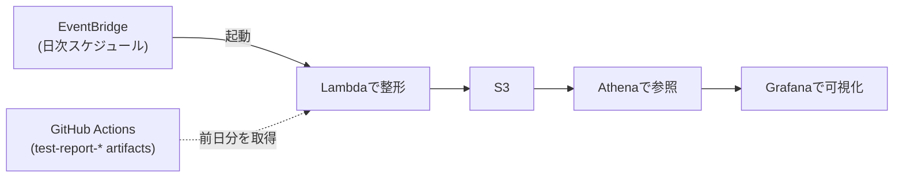
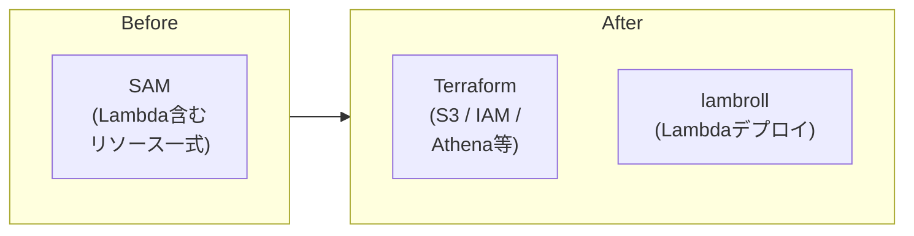

## はじめに

[paiza株式会社](https://www.paiza.co.jp/)でエンジニアをしている長谷川です。paizaではプログラミング学習や、エンジニア向けの転職サービスなどを提供しています。

この記事では、社内のCI高速化/安定化委員会で上期に取り組んだ内容を紹介します。GitHub ActionsでRSpec / Railsを動かしているチームが、CIの計測・可視化からどう改善に繋げていったかを書きます。

CIの改善というと、まず「何分短縮できたか」に目が向きがちです。もちろん実行時間の短縮は重要です。一方で、CIが落ちたときに原因を追えない、過去にも同じ失敗が起きていたのか分からない、どこから手をつけるべきか判断しづらい、という状態では継続的な改善が難しくなります。

今回の上期では、いきなり大きな高速化を狙うのではなく、まずCIの状態を見えるようにし、改善対象を判断できる土台を作ることを重視しました。

## 委員会活動について

paizaでは、プロダクト開発を進める中で見えてきた技術的な課題や、開発体験に関する課題を継続的に改善するために、委員会活動を行っています。

日々の開発では、目の前の機能開発や不具合修正が優先されます。一方で、CIの安定化、テストの整理、開発環境の改善のような取り組みは、重要であっても後回しになりやすいです。

委員会活動では、そのような課題を拾い上げ、半期ごとにテーマを決めて継続的に改善に取り組んでいます。

CI高速化/安定化委員会では、CIの待ち時間や不安定さを減らし、開発部全体の生産性を底上げすることを目標にしています。

## 背景

paizaではCI基盤としてGitHub Actionsを利用しています。以前はCircleCIを利用しており、移行に伴ってCircleCI時代に持っていた可視化や運用の仕組みを再構築する必要が出てきていました。

特に困っていたのは、CIが失敗したときに、その失敗が単発なのか、継続的に発生しているflakyなテストなのかを判断しづらいことです。

ここでいうflakyなテストは、コードを変えていないにもかかわらず、実行タイミングや環境差などによって成功したり失敗したりする不安定なテストを指します。

CIが落ちたときに毎回ログを手で追い、必要に応じてrerunし、場合によってはローカルで再現確認する。この運用は小さく見えても、開発者の集中を削り、チーム全体では大きな待ち時間になります。

そこで上期は、CI高速化と安定化に向けて、以下のような方針で進めました。

- CIの失敗履歴を蓄積し、後から確認できるようにする
- flakyなテストを見つけるための土台を作る
- 重くなりやすいfeature specを棚卸しする
- CI可視化基盤を継続運用しやすい形に寄せる
- 高速化に効きそうなボトルネック候補を小さく検証する

この順序にしたのは、高速化やflaky対応を継続的に進めるには、まず判断材料が必要だったためです。CIの実行時間を短くする案はいくつか考えられますが、どこに時間がかかっているのか、どの失敗が繰り返し起きているのかが見えないままだと、効果の薄い改善に時間を使ってしまう可能性があります。そこで、最初に計測と可視化を整え、そのうえでテスト整理や高速化の検証へ進める方針にしました。

## 上期の目標

上期に設定した主な目標と結果は次のとおりです。

| 目標 | 結果 | 状況 |
| --- | --- | --- |
| CI失敗の可視化基盤の構築 | 定期実行されたCIの失敗情報を収集し、Athena / Grafanaから参照できる状態にした | 土台は構築済み。Grafana上でのflaky判定ロジックは下期以降 |
| 計測と可視化 | CIの失敗履歴を蓄積し、過去の失敗状況を確認できるようにした | 継続蓄積できる状態 |
| feature specの棚卸しと軽量化 | feature specを一覧化し、代表的なspecについて削除・移植・維持の判断材料を整理した | 代表例5件を整理。うち2件はPR作成済み |
| CI可視化基盤のTerraform化 | SAMで作成されていたリソースをTerraform管理へ寄せ、新版と旧版を並行稼働できる状態にした | 移行準備済み。新版への切り替えは今後 |
| CI高速化検証 | テスト環境のMySQL設定、CIセットアップ、キャッシュ利用などを見直す高速化案をPR化した | 検証中 |

上期は、高速化や安定化そのものを完了させたというより、改善を継続するために必要な計測・可視化を整えた期間でした。

## 改善前の課題

### CIの失敗履歴を追いづらい

GitHub Actions上でも、個別のCI実行結果やログは確認できます。

ただし、失敗したテストが過去にも失敗していたのか、特定のspecだけが繰り返し落ちているのか、いつごろから失敗し始めたのかを横断的に見るには手間がかかっていました。

そのため、CIが落ちたときに次のような判断がしづらい状態でした。

- 単発の失敗なのか
- flakyなテストなのか
- 最近の変更で壊れたのか
- 以前から断続的に失敗しているのか

失敗履歴を追えないと、対応の優先度も決めづらくなります。

### feature specの扱いを判断しづらい

feature specは、ユーザー操作に近い観点を確認できる一方で、実行時間が長くなりやすく、CI全体の待ち時間にも影響します。

この記事でいうfeature specは、RSpecでブラウザ操作に近い流れを検証するテストを指します。画面をまたいだユーザー体験を確認しやすい反面、request specなどに比べると実行コストが高くなりやすいテストです。

ただ、単に「遅いから削除する」というわけにはいきません。何を担保しているテストなのか、request specなどへ移植できるのか、今も残す必要があるのかを確認する必要があります。

当時は、feature spec全体を見渡し、削除・移植・維持の方針を議論するための材料が不足していました。

### 可視化基盤の運用を整える必要がある

CIの失敗情報を可視化する基盤は、一度作れば終わりではありません。継続的に運用するためには、インフラ構成やデプロイ方法も既存の運用に合わせておく必要があります。

既存の一部リソースはSAMで作られていましたが、社内の他のインフラ運用に合わせるにはTerraform管理へ寄せたい状態でした。

SAMはAWS Serverless Application Modelのことで、サーバーレスアプリケーションを構成・デプロイするための仕組みです。今回は基盤の管理方法を社内の運用に揃えるため、Terraform管理へ寄せる判断をしました。

### 高速化のボトルネックが分散している

CIの実行時間は、テスト実行そのものだけで決まるわけではありません。

DB書き込み、Node.js / npmのセットアップ、フロントエンド成果物の受け渡し、FactoryBotによるデータ生成、feature specの後処理など、待ち時間の原因は複数箇所に分散しています。

そのため、大きな変更を一気に入れるのではなく、効果と副作用を確認しやすい単位で検証する必要がありました。

## 実際にやったこと

### CI失敗情報を収集して可視化する

まず、定期実行されたCIで失敗したテスト情報をartifactsとして残し、EventBridgeで日次起動するLambdaが前日分のartifactsをまとめてS3に格納・整形 → Athena / Grafanaから参照できる構成にしました。

大まかな流れは次のような形です。




*可視化の雰囲気を伝えるためのスクリーンショットです。実際のファイル名などはマスキングしています。*

これにより、CIが落ちたときに過去の失敗履歴を確認しやすくなりました。

Grafanaでは、GitHub Actionsのテスト結果について、失敗の時系列やspec単位の失敗履歴を確認できます。デフォルトでは直近30日分の失敗履歴を表示し、失敗したテストが過去にも繰り返し落ちているのかを追うための入口として使う想定です。

また、通常は前日分のartifactsを定期処理しつつ、引数で任意の日付を指定して再処理できるようにしました。過去データの再集計や、特定日の失敗調査にも使いやすくするためです。

### flakyテストへの対応方針を整理する

flakyテストへの対応では、単に履歴を見られるだけでなく、問題に気づける運用まで持っていく必要があります。

上期では、テストのリトライによる自動flaky判定は採用しない方針としました。リトライは「失敗を握りつぶす」方向に寄りやすく、本来見えるべきCIの不安定さを隠してしまうリスクがあるためです。失敗が起きたら従来どおり即時通知し、人が気づける運用は維持しています。

そのうえで、判断材料となる失敗履歴を S3 → Athena → Grafana に集約し、後から横断的に追えるようにしました。Grafanaダッシュボード上での具体的なflaky判定ロジック（同じspecが直近で繰り返し落ちているかなど）の整備は、下期以降の課題として残しています。

### feature specを棚卸しする

feature specについては、まず一覧化し、削除・移植・維持の方針を議論するための材料を揃えました。一覧作成や分類の初速を上げるため、AIエージェントのDevinも活用しています。人手だけで全体を眺めるのは時間がかかるため、機械的に整理できる部分は早めに任せる方針です。

代表的なfeature specを5つピックアップし、委員会内で方針を確認しました。そのうち2件については、方針に沿った修正PRまで作成しています。

PRは、レビューしやすく、今後ほかのfeature specを修正するときに近いケースを参照しやすい単位に分けました。

### CI可視化基盤をTerraform化する

CI失敗情報の可視化基盤については、SAMで作成されていたリソースをTerraform化しました。

既存のリソースをいきなり置き換えるのではなく、新版と旧版を並行稼働できる状態にしています。移行中の影響を抑えながら、段階的に新版へ寄せるためです。

before / after の構成イメージは次のような形です。



Terraform化のタイミングでは、IAM権限の妥当性も確認しました。結果として、SAM側で過剰な権限が付与されている問題は見つかりませんでしたが、構成を移すタイミングで権限を改めて確認できた点はよかったです。

また、Lambdaのデプロイは既存のlambrollを使った仕組みに合わせました。CI可視化基盤だけが別運用にならないようにするためです。

lambrollはAWS Lambdaのデプロイに使うツールです。既存のLambda運用と合わせることで、CI可視化基盤だけ特別な手順を持たないようにしました。

### CI高速化の検証PRを作る

高速化については、実行時間に影響していそうな箇所を複数洗い出し、小さく検証できる形でPR化しました。

検証対象は次のようなものです。

| 対象 | なぜ検証するか | 検証内容 |
| --- | --- | --- |
| MySQLのディスク同期コスト | CIのテストDBでは、本番DBほど障害時の永続性を重視しなくてよい | `innodb_flush_log_at_trx_commit=0` と `sync_binlog=0` を設定し、コミットごとのディスク同期コストを下げる |
| feature spec以外のNode.jsセットアップ | feature spec以外ではフロントエンド依存をすべて入れる必要が薄く、`npm ci` が待ち時間になりやすい | feature spec以外では `npm ci` を省略し、Node.jsセットアップのみに寄せる |
| `public/packs` の受け渡し | 毎回artifactを作成・取得すると、ビルド成果物の受け渡し自体が待ち時間になる | `public/packs` をartifactではなくcacheで復元する形に変更する |
| FactoryBotの実行コスト | テスト時間の遅さがfactoryの過剰生成に起因している可能性がある | FactoryProfの結果をartifactとして保存し、遅いfactoryを後から確認できるようにする |
| feature specの後処理 | 各specの後処理に固定の `sleep` が入ると、件数に比例して待ち時間が積み上がる | feature spec後処理の不要な `sleep` を削除する |
| factoryの関連生成 | factory内で不要な関連レコードが作られると、DB書き込みとテスト実行時間が増える | 一部factoryの関連生成を見直し、不要なレコード作成を抑える |

たとえばMySQLのディスク同期設定は、テスト用DBに対して次のような設定を入れています。

```ini
# CI用 my.cnf
[mysqld]
innodb_flush_log_at_trx_commit = 0
sync_binlog                    = 0
```

`innodb_flush_log_at_trx_commit=0` は、コミット毎にREDOログをディスクへフラッシュする処理をやめ、書き出し頻度を1秒間隔に緩めます。`sync_binlog=0` は、バイナリログのディスク同期タイミングをMySQL側でコミット毎に制御せず、OSに任せる設定です。どちらも本番ではクラッシュ時のデータ損失リスクが上がるため使えませんが、CIのテストDBであれば壊れたら作り直せばよいので、書き込みコストを大きく下げられます。

現時点では検証中のため、この記事では「高速化が完了した成果」ではなく、「高速化に向けた検証着手」として扱っています。現在の検証では、対象のCIで約3分の短縮が期待できる見込みです。

確認観点としては、単に実行時間が短くなるかだけでなく、次の点も見ています。

- MySQL設定変更によって、テストの安定性や失敗時の調査に悪影響が出ないか
- cache化により、古い `public/packs` の利用や成果物の取り違えが発生しないか
- FactoryProfの計測結果が、今後の追加高速化の判断材料として使えるか

CIは開発者全員が毎日使うものなので、速くなっても不安定になれば意味がありません。高速化と安定性のバランスを見ながら進めています。

## Before / After

上期の取り組みによって、次のような変化がありました。

| 観点 | Before | After |
| --- | --- | --- |
| CI失敗時の確認 | 過去の失敗履歴を追いづらかった | 失敗情報を S3 → Athena → Grafana に蓄積し、直近30日分をデフォルトで横断的に確認できるようになった |
| flaky対応 | 単発失敗かflakyかを判断しづらく、rerunやローカル確認に頼りがちだった | 履歴ベースで判断する土台ができた。Grafana上でのflaky判定ロジック整備は下期以降の課題 |
| feature spec | どのspecを残す・移植する・削除するかの判断材料が不足していた | 一覧化と方針整理により、今後の修正方針を共有しやすくなった |
| CI可視化基盤 | SAMで作られたリソースがあり、移行時に扱いづらさが残っていた | Terraform化し、旧版と新版を並行稼働しながら段階的に移行できる状態になった |
| CI高速化 | DB書き込み、不要なセットアップ、成果物受け渡しなどが実行時間に影響している可能性があった | MySQL設定、セットアップ、キャッシュ利用などを見直すPRを作成し、対象CIで約3分短縮できる見込み |

## 残っている課題

今回の上期で、CI高速化/安定化に関する課題がすべて解決したわけではありません。

特に、次の課題は下期以降も継続して取り組む予定です。

### flakyテストに気づける運用を作る

失敗履歴を蓄積できるようになったので、次は問題に気づくための運用が必要です。

リトライによる自動flaky判定は採用しない方針なので、Grafanaダッシュボード上での失敗パターン可視化や、必要に応じたアラート通知を整備し、CIが不安定になったときに早く気づける状態を目指します。

### feature specの整理を全体へ展開する

上期では、代表的なfeature specの方針整理と一部PR作成まで進みました。

今後は、整理した方針をもとに、対象specへの展開順と対応範囲を決めていく必要があります。削除できるもの、request specなどへ移植するもの、feature specとして残すべきものを、実際の担保内容に沿って判断していきます。

### Terraform化した基盤を新版へ切り替える

CI可視化基盤はTerraform化し、新版と旧版を並行稼働できる状態にしました。

今後は、並行稼働中の安定性を確認し、問題がなければ新版へ切り替えていきます。

### 高速化検証の効果と副作用を確認する

高速化PRは検証中です。

実行時間がどの程度短縮されるかだけでなく、テストの安定性や調査しやすさに悪影響がないかを確認する必要があります。特にキャッシュやDB設定の変更は、速くなる一方で問題が見えづらくなる可能性もあるため、慎重に判断します。

## おわりに

CIの高速化や安定化は、単発の改善だけで終わるものではありません。

今回の上期では、まずCIの失敗情報を蓄積し、過去の失敗履歴を確認できる土台を作りました。また、feature specの棚卸し、可視化基盤のTerraform化、高速化に向けた検証にも着手しました。

まだ、flakyテスト通知やfeature spec整理の全体展開、高速化PRの効果確認など、残っている課題はあります。それでも、CIが落ちたときに判断材料がない状態から、履歴を見ながら改善対象を議論できる状態へは前進できました。

CIは、開発者全員の作業に毎日影響する基盤です。地味な改善も多いですが、待ち時間や不安定さを少しずつ減らし、開発しやすい状態を作っていきたいです。
