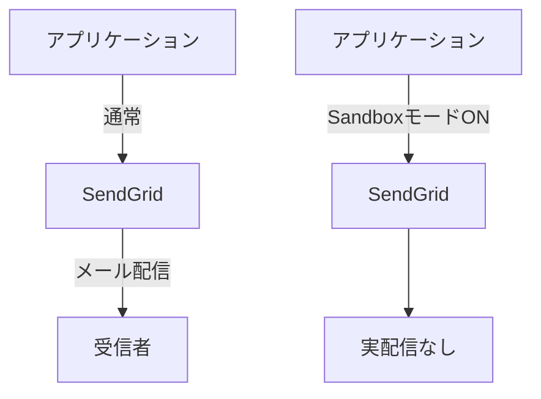
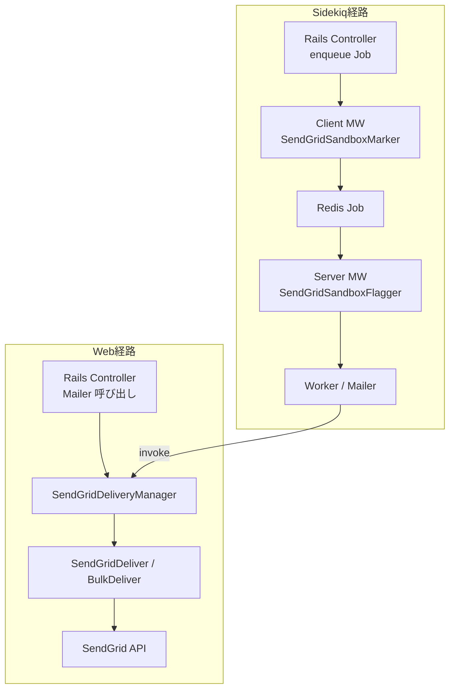
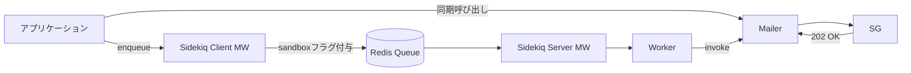

## はじめに
開発やステージング環境での検証時に、実ユーザーへメールを配信する必要はありません。しかし、SendGrid へは通常どおり Web API リクエストが発行されるため、**送信リクエスト数ベースの課金** が発生し、無駄なコストにつながります。

また、開発環境やステージング環境で実際にメールを送信してしまうと、誤送信によるユーザー混乱や情報漏洩のリスクもあります。とはいえ、メール送信の動作検証は重要であり、テスト環境でも実際の送信フローをできるだけ忠実に再現したいというニーズがあります。この「現実的なテスト環境の構築」と「コスト・リスクの抑制」という相反する要件のバランスを取ることが課題となっています。

具体的な背景として、当社では SendGrid を用いた開発時メール送信が週約70万通規模に達しており、開発やステージング環境においても同様に SendGrid の Web API を叩いていました。このため、テスト環境からの送信リクエストも課金対象となり、月額数万円規模の無駄なコスト増大が顕在化していました。ステージング環境においても実際の送信処理を安全かつ忠実に検証したい一方で、コストと誤送信リスクの両面を抑制したいという強い要望がありました。

---

## Sandbox モードの概要
- **通常送信**: リクエスト → 実際に相手へ配信される
- **Sandbox 送信**: リクエスト → 正常応答は返るが、実配信は行われない

> フローの違い（概念図）


Sandbox は「配信はしないが、アプリケーションの処理フローは保つ」ため、開発・検証環境に適しています。

---


## アーキテクチャ概要（本記事の方針）
- **dev/stg** では Sandbox を既定で有効化
- **prod** では Sandbox を無効化（通常配信）
- Sidekiq **Client/Server ミドルウェア**で **ジョブ単位**に Sandbox フラグを受け渡し
- Worker 側でフラグを参照して SendGrid Web API 呼び出しに反映

> 経路フロー図（概念図・Mermaid）


> ジョブ実行フロー（概念図）


---

## 実装

### 1) 環境変数によるデフォルト切り替え
`PREFER_SENDGRID_SANDBOX_MODE` を boolean で管理します。

```ruby
# config/sendgrid.rb など
PREFER_SENDGRID_SANDBOX_MODE = ENV["PREFER_SENDGRID_SANDBOX_MODE"] == "true"
```

### 2) Sidekiq Client ミドルウェア（enqueue 時に付与）
ジョブ引数の最後に **オプション Hash** を差し込みます（既存ジョブに影響を与えないよう最後尾を推奨）。

```ruby
module Sidekiq
  module Middleware
    module Client
      class SendGridSandboxMarker
        # SendGrid のサンドボックスモード設定をジョブに付与する
        def call(_worker_class, job, _queue, _redis_pool)
          job['prefer_sendgrid_sandbox_mode'] = true if ENV.fetch('PREFER_SENDGRID_SANDBOX_MODE', 'false') == 'true'

          yield
        end
      end
    end
  end
end
```

### 3) Sidekiq Server ミドルウェア（実行時の最終決定）
サーバー側でも最終的な Sandbox 値を確定します。必要に応じて **特定ジョブだけ無効化/有効化** などの細かい制御も可能です。

```ruby
module Sidekiq
  module Middleware
    module Server
      # SendGrid のサンドボックスモードをスレッドに設定する
      class SendGridSandboxFlagger
        # @param worker [Object] 実行中のワーカーインスタンス
        # @param job [Hash]    ジョブ情報
        # @param queue [String] キュー名
        def call(_worker, job, _queue)
          Thread.current[:sidekiq_prefer_sendgrid_sandbox_mode] = true if job['prefer_sendgrid_sandbox_mode']

          yield
        ensure
          Thread.current[:sidekiq_prefer_sendgrid_sandbox_mode] = nil
        end
      end
    end
  end
end
```

特定のドメイン（例: 社内ドメインやテスト用ドメイン）宛のメールについては、Sandbox モードの例外として実際に送信を許可したい場合があります。宛先メールアドレスをチェックし、該当ドメインであれば `sandbox` フラグを上書きして無効化することが可能です。以下はその一例です。

```ruby
module SendGridSandbox
  INTERNAL_DOMAINS = ['xxx.jp', 'xxx.co.jp'].freeze

  class << self
    # sandbox が「実際に」有効かどうか判定
    # グローバル設定が有効かつ社内ドメインを含まない場合のみ true
    # @param recipients [Array<String>] 送信先メールアドレス一覧
    # @return [Boolean]
    def enabled?(recipients:)
      sandbox_enabled = Thread.current[:sidekiq_prefer_sendgrid_sandbox_mode] ||
                        ENV.fetch('PREFER_SENDGRID_SANDBOX_MODE', 'false') == 'true'
      return false unless sandbox_enabled

      # 社内ドメインチェック：含まれている場合は false
      return false if recipients.any? do |email|
        domain = email.split('@')[1]
        INTERNAL_DOMAINS.include?(domain)
      end

      true # 社内ドメインが含まれていない
    end

    # サンドボックスモードを有効にした SendGrid::MailSettings を生成して返す
    # @return [::SendGrid::MailSettings]
    def sandbox_mail_settings
      mail_settings = ::SendGrid::MailSettings.new
      mail_settings.sandbox_mode = SendGrid::SandBoxMode.new(enable: true)
      mail_settings
    end
  end
end
```

### 5) SendGrid Web API 呼び出し例

```ruby
    sg_mail = ::SendGrid::Mail.new
    .
    .
    .

    # 全受信者を対象にサンドボックスが有効か判定し、有効なら設定を適用
    all_recipients = to_emails | cc_emails | bcc_emails

    # サンドボックスモードが有効な場合、SendGridのMailSettingsにサンドボックスモードを設定
    if SendGridSandbox.enabled?(recipients: all_recipients)
      sg_mail.mail_settings = SendGridSandbox.sandbox_mail_settings
    end
    .
    .
    .
```

---

## 効果（導入前後の比較）

| 指標 | 導入前 | 導入後 |
|---|---:|---:|
| 送信リクエスト数（週次） | 平均約70万通 | 平均約3万通 |
| 削減率 |  | **約 80% 減** |
| 請求傾向 | 増加基調 | 安定化 |


### 詳細分析

導入により以下の具体的な効果が確認されました：

- **週次削減数**: 約67万通のテスト送信を抑制
- **月間削減数**: 約268万通（67万通 × 4週）
- **年間削減数**: 約3,216万通規模
- **コスト削減額**: 月額数万円規模の削減を実現
- **誤送信リスク**: ゼロ件を維持（Sandboxモード適用環境）

特に開発環境での大量テストや、CI/CDパイプラインでの自動テスト実行時の送信抑制が大きく貢献しています。社内ドメイン宛の例外処理により、必要な検証は継続しながらも、外部への誤送信リスクを完全に排除できました。

---

## 検証観点と注意点
- **Sandbox でもリクエスト課金は発生**（= リクエスト自体が課金単位のため）
- **SMTP 経由には未対応**（Web API 経由のみ）
- **本番誤適用の防止**: 環境変数の運用・デプロイ時の設定確認
- **社内/テストドメイン宛の例外対応**も可能（sandbox 有効時でも特定ドメインは実送信）

---

## まとめ
- SendGrid の Sandbox モードと Sidekiq ミドルウェアの組み合わせにより、**環境別・ジョブ単位での柔軟なメール送信抑制**が可能となりました。これにより、開発・ステージング環境での誤送信リスクを大幅に低減しつつ、実際の送信フローに近い形で動作検証が行えます。
- Sidekiq の Client/Server ミドルウェアを活用してジョブに Sandbox フラグを付与・伝搬する設計は、チーム内のワークフローに自然に組み込みやすく、運用面でも分かりやすい構造です。これにより、個別ジョブごとの例外対応や段階的な導入も容易に実現できます。
- コスト面では、送信リクエスト数を約 80% 削減でき、SendGrid の課金負担を抑制。さらに、誤送信によるユーザー体験の悪化やセキュリティリスクを軽減し、サービスの信頼性向上にも貢献しています。

### 教訓と今後の展望

本導入を通じて得られた教訓として、単純に Sandbox モードを有効化するだけではなく、Sidekiq ジョブ基盤やメール送信フローに密に組み込む設計が不可欠であることが明確になりました。特に、例外ケース（社内ドメイン宛など）を柔軟に扱う仕組みを設計段階で盛り込むことが、運用の安定化と誤送信防止に寄与しました。また、テスト環境におけるコストとリスクの「見える化」が関係者の理解促進と方針決定を後押しし、効果的な運用改善につながった点も重要なポイントです。

今後の展望としては、メールインフラ全体の統合的なコスト管理や監視体制の強化を進めることが挙げられます。具体的には、SMTP 経由の送信抑制や代替設計の検討、社内ポリシーとの連携強化、より詳細なメトリクスやアラートの導入による運用効率化が期待されます。また、今回の仕組みを他サービスや他環境へ横展開し、組織全体でのメール送信管理の高度化を図ることも重要な課題です。
