## この記事で伝えたいこと

開発環境で大量のテストメールが実際に送信されていた問題を、SendGridのSandboxモードとSidekiqミドルウェアの組み合わせで解決し、以下を実現しました：

1. **コスト削減**: 送信リクエスト数を**約95%削減**し、大幅なコストカットを実現
2. **誤送信リスクゼロ**: 開発環境からの実ユーザーへの誤送信を完全防止
3. **柔軟な制御**: ジョブ単位・ドメイン単位での送信制御を実現

本記事では、Sidekiqのミドルウェアを活用した実装方法と、運用で得られた知見を共有します。

## はじめに：なぜSandboxモードが必要だったのか
### 直面していた3つの課題

#### 1. コスト問題
- 開発環境で大量のテストメールが実際に送信されていた
- SendGridの送信リクエスト数ベース課金による無駄なコスト発生
- テスト実行のたびに課金が積み上がる状況

#### 2. 誤送信リスク
- 開発環境から実ユーザーへの誤送信の危険性
- 情報漏洩やユーザー混乱のリスク
- 一度の設定ミスで大量誤送信の可能性

#### 3. テスト環境の制約
- 実際の送信フローを検証したいが、実送信はしたくない
- 「現実的なテスト」と「安全性」の両立が困難
- 環境ごとの柔軟な制御が必要

## 解決策：SendGrid Sandboxモードの活用
### Sandboxモードとは
SendGridのAPIに対して送信リクエストは行うが、実際のメール配信はスキップする機能です。

- **通常モード**: API呼び出し → SendGridが実際にメール配信
- **Sandboxモード**: API呼び出し → SendGridが正常応答を返す（配信はスキップ）
```mermaid
flowchart TB
  A[アプリケーション] -->|通常| SG[SendGrid]
  SG -->|メール配信| RCPT[受信者]

  A2[アプリケーション] -->|SandboxモードON| SG2[SendGrid]
  SG2 --> 実配信なし
```

**重要**: アプリケーション側の処理フローは通常通り実行されるため、実環境に近い形でテストが可能です。

## 実装方針：Sidekiqミドルウェアでジョブ単位制御
### 設計のポイント
1. **環境別デフォルト設定**: 開発/ステージングはSandbox有効、本番は無効
2. **ジョブ単位の制御**: Sidekiqミドルウェアでジョブごとにフラグ管理
3. **例外処理**: 社内ドメイン宛など特定条件での実送信を許可
4. **透過的な実装**: 既存コードへの影響を最小限に

> 経路フロー図（概念図・Mermaid）
```mermaid
flowchart TB
  subgraph Sidekiq経路
    SC["Rails Controller<br>enqueue Job"] --> CMW["Client MW<br>SendGridSandboxMarker"]
    CMW --> RJ["Redis Job"]
    RJ --> SMW["Server MW<br>SendGridSandboxFlagger"]
    SMW --> WK["Worker / Mailer"]
  end
  subgraph Web経路
    RC["Rails Controller<br>Mailer 呼び出し"] --> SGE["SendGridDeliveryManager"]
    SGE --> DELIV["SendGridDeliver / BulkDeliver"]
    DELIV --> API["SendGrid API"]
  end
  WK -- invoke --> SGE
```

> ジョブ実行フロー（概念図）

```mermaid
flowchart LR
  App[アプリケーション] -->|enqueue| CMW[Sidekiq Client MW]
  CMW -->|sandboxフラグ付与| Q[(Redis Queue)]
  Q --> SMW[Sidekiq Server MW]
  SMW --> W[Worker]
  
  App -->|同期呼び出し| M[Mailer]
  W --> |invoke| M
  M --> SG
  SG -->|202 OK| M
```


## 実装の詳細

### Step 1: 環境変数でデフォルト設定
`PREFER_SENDGRID_SANDBOX_MODE` を boolean で管理します。

```ruby
# config/sendgrid.rb など
PREFER_SENDGRID_SANDBOX_MODE = ENV["PREFER_SENDGRID_SANDBOX_MODE"] == "true"
```

### Step 2: Sidekiq Clientミドルウェア（ジョブ登録時）
ジョブにSandboxフラグを付与します。

```ruby
module Sidekiq
  module Middleware
    module Client
      class SendGridSandboxMarker
        # SendGrid のサンドボックスモード設定をジョブに付与する
        def call(_worker_class, job, _queue, _redis_pool)
          job['prefer_sendgrid_sandbox_mode'] = true if ENV.fetch('PREFER_SENDGRID_SANDBOX_MODE', 'false') == 'true'

          yield
        end
      end
    end
  end
end
```

### Step 3: Sidekiq Serverミドルウェア（ジョブ実行時）
Worker実行時にSandboxフラグをThread localに設定します。

```ruby
module Sidekiq
  module Middleware
    module Server
      # SendGrid のサンドボックスモードをスレッドに設定する
      class SendGridSandboxFlagger
        # @param worker [Object] 実行中のワーカーインスタンス
        # @param job [Hash]    ジョブ情報
        # @param queue [String] キュー名
        def call(_worker, job, _queue)
          Thread.current[:sidekiq_prefer_sendgrid_sandbox_mode] = true if job['prefer_sendgrid_sandbox_mode']

          yield
        ensure
          Thread.current[:sidekiq_prefer_sendgrid_sandbox_mode] = nil
        end
      end
    end
  end
end
```

### Step 4: 例外処理の実装（社内ドメイン宛は実送信）

```ruby
module SendGridSandbox
  INTERNAL_DOMAINS = ['xxx.jp', 'xxx.co.jp'].freeze

  class << self
    # sandbox が「実際に」有効かどうか判定
    # グローバル設定が有効かつ社内ドメインを含まない場合のみ true
    # @param recipients [Array<String>] 送信先メールアドレス一覧
    # @return [Boolean]
    def enabled?(recipients:)
      sandbox_enabled = Thread.current[:sidekiq_prefer_sendgrid_sandbox_mode] ||
                        ENV.fetch('PREFER_SENDGRID_SANDBOX_MODE', 'false') == 'true'
      return false unless sandbox_enabled

      # 社内ドメインチェック：含まれている場合は false
      return false if recipients.any? do |email|
        domain = email.split('@')[1]
        INTERNAL_DOMAINS.include?(domain)
      end

      true # 社内ドメインが含まれていない
    end

    # サンドボックスモードを有効にした SendGrid::MailSettings を生成して返す
    # @return [::SendGrid::MailSettings]
    def sandbox_mail_settings
      mail_settings = ::SendGrid::MailSettings.new
      mail_settings.sandbox_mode = SendGrid::SandBoxMode.new(enable: true)
      mail_settings
    end
  end
end
```

### Step 5: SendGrid API呼び出し時の適用

```ruby
    sg_mail = ::SendGrid::Mail.new
    .
    .
    .

    # 全受信者を対象にサンドボックスが有効か判定し、有効なら設定を適用
    all_recipients = to_emails | cc_emails | bcc_emails

    # サンドボックスモードが有効な場合、SendGridのMailSettingsにサンドボックスモードを設定
    if SendGridSandbox.enabled?(recipients: all_recipients)
      sg_mail.mail_settings = SendGridSandbox.sandbox_mail_settings
    end
    .
    .
    .
```

## 導入効果

### 📉 主要指標の改善

| 指標 | 改善結果 |
|:---|:---|
| **送信リクエスト数** | **約95%削減** |
| **コスト** | **80%以上削減** |
| **誤送信リスク** | **100%防止** |


### 📊 環境別の改善効果

- **開発環境**: 99%削減（CI/CDパイプライン含む）
- **ステージング環境**: 95%削減（社内ドメイン宛のみ実送信）
- **本番環境**: 影響なし（通常通り送信）

特に開発環境での大量テストや、CI/CDパイプラインでの自動テスト実行時の送信抑制が大きく貢献しています。

## 運用上のポイント

### ✅ メリット
- 環境別の柔軟な制御が可能
- 既存コードへの影響が最小限
- ジョブ単位での細かい制御が可能
- 社内ドメイン宛などの例外処理が容易

### ⚠️ 注意点
- SandboxモードでもAPIリクエスト課金は発生（ただし大幅削減）
- SMTP経由の送信には未対応（Web APIのみ）  
- 本番環境での誤適用防止のため、環境変数の管理が重要
- デプロイ時の設定確認が必須

## まとめ

SendGridのSandboxモードとSidekiqミドルウェアを組み合わせることで、以下の3つの目標を達成しました：

### 🎯 達成した成果
1. **コスト削減**: 送信リクエスト数を95%削減し、大幅なコストカットを実現
2. **リスク排除**: 開発環境からの誤送信ゼロを実現  
3. **柔軟な制御**: 環境別・ジョブ別・ドメイン別の細かい制御を実現

### 💡 得られた知見

#### 技術面
- Sidekiqミドルウェアによるジョブ単位制御が非常に効果的
- Thread localを活用したスコープ限定の設定管理が有効
- 既存コードへの影響を最小限にした設計が重要

#### 運用面  
- 環境変数による制御でデプロイがシンプルに
- 社内ドメイン宛の例外処理が検証効率を大幅改善
- コストの「見える化」が経営層の理解を促進

### 🚀 今後の展望
- SMTP経由の送信への対応検討
- 他サービスへの横展開
- より詳細なメトリクス収集と監視体制の構築

本取り組みは、コスト削減とリスク低減を両立しながら開発効率を維持する、実用的なソリューションとなりました。同様の課題を抱えるチームの参考になれば幸いです。
